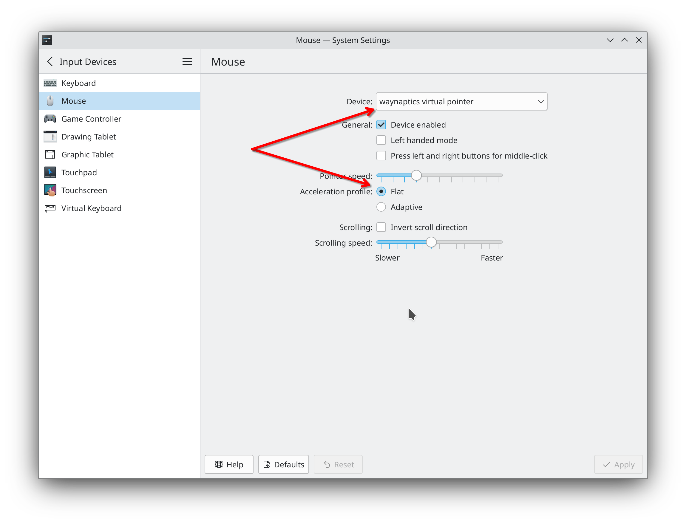

# Waynaptics - synaptics "driver" for Wayland


## Why? 

libinput is way too opinionated to give me the [**EXACT**](https://xkcd.com/1172/) setup I've had with Xorg. Wayland compositors also often don't provide customization UI for touchpads, so users are stuck with what's there.

## How?

Waynaptics implements the minimal set of Xorg APIs to run the original synaptics driver without an actual Xorg. On start it grabs your touchpad device, feeds it to synaptics driver and then feeds its output to an emulated Lenovo ScrollPoint mouse using uinput. This particular model is used because it has hacks in libinput codebase to enable smooth scrolling with wheel.

## How to install

### Prebuilt packages

Download the latest packages from [Releases](../../releases):

- **Debian/Ubuntu**: `sudo dpkg -i waynaptics.deb` and optionally `waynaptics-config.deb`
- **Fedora/RHEL**: `sudo dnf install ./waynaptics.rpm` and optionally `waynaptics-config.rpm`
- **Arch Linux**: `sudo pacman -U waynaptics-*.pkg.tar.zst` and optionally `waynaptics-config-*.pkg.tar.zst`

The daemon package installs a systemd service that starts automatically.

### Build from source

```bash
# Install dependencies
# Debian/Ubuntu: apt install build-essential cmake pkg-config libevdev-dev libglib2.0-dev
# For config tool add: qt6-base-dev

cmake -B build -DCMAKE_BUILD_TYPE=Release
cmake --build build
sudo cmake --install build --prefix /usr

# To build without the config tool (no Qt6 dependency):
cmake -B build -DCMAKE_BUILD_TYPE=Release -DBUILD_CONFIG_TOOL=OFF
```

## How to configure

### Option A: Configuration tool (recommended)

Install the `waynaptics-config` package (or build with `-DBUILD_CONFIG_TOOL=ON`). The tool connects to the running daemon via its config socket and provides a graphical interface for all touchpad parameters — scrolling, tapping, pointer motion, sensitivity, and click zones with live touchpad visualization.

Launch it from your application menu (Waynaptics Configuration) or run `waynaptics-config` from the terminal.

### Option B: Copy config from X11

Grab your existing settings from your old X11 session using `synclient > waynaptics.conf`, then copy it to `/etc/waynaptics.conf` and restart the service via `systemctl restart waynaptics.service`.

### Running manually

If you are running manually, specify the config via `-c waynaptics.conf`.

There are some extra options you can specify from command line:

```
Synaptics touchpad → PS/2 mouse emulator via uinput.

Options:
  -c, --config <file>   Path to synclient parameter dump
  -d, --device <path>   Specific evdev device path (auto-detect if omitted)
  -n, --device-name <name>
                        Match evdev device by name substring (e.g. "Touchpad")
      --mouse-type <type>
                        scroll-point (default) or generic
      --scroll-factor <N>
                        Scroll speed multiplier (default: 5 for scroll-point)
      --dry             Dry mode: don't grab device, don't create uinput
      --no-hires-scroll Disable hi-res scroll events (REL_WHEEL_HI_RES)
      --no-lores-scroll Disable low-res scroll events (REL_WHEEL)
  -s, --socket <path>   Config socket path (for runtime control)
      --log-evdev       Log raw evdev touchpad events to stderr
      --log-output      Log produced mouse/scroll output events to stderr
  -h, --help            Print this help and exit
```

You might need to adjust the unit by specifying device from command line (use --device-name and get the name from evtest or smth).

### Adjust DE settings

DISABLE mouse acceleration for your mouse, otherwise libinput will apply accel profile on top of synaptics accel profile. In KDE you can do this for individual pointer devices, not sure about other DEs.




### Scripting configuration via socket

If you start waynaptics with `--socket /var/run/waynaptics.sock` (the default for the systemd service), you can query and modify settings at runtime. The configuration tool uses this socket. You can also use socat directly:

```bash
# Dump current config
echo "get_config" | socat - UNIX-CONNECT:/var/run/waynaptics.sock

# Change a setting
echo "set_option MinSpeed=2.0" | socat - UNIX-CONNECT:/var/run/waynaptics.sock

# Save current settings to the config file (requires --config)
echo "save" | socat - UNIX-CONNECT:/var/run/waynaptics.sock
```


